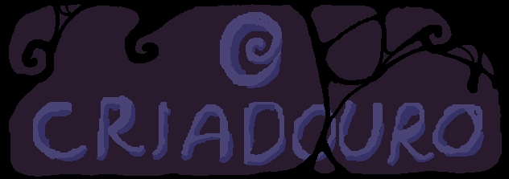
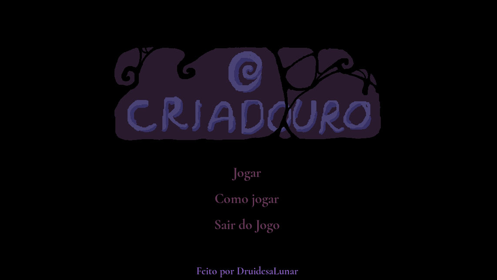

# O Criadouro
**Status:** *em desenvolvimento...*

  

## Sobre o Projeto

**O Criadouro** é um jogo de terror em pixel art que combina dinossauros e viagem no tempo. Você assume o papel de um cientista que, após receber a capacidade de viajar no tempo de uma entidade desconhecida, é forçado a voltar às eras pré-históricas. Seu objetivo é coletar DNA de dinossauros vivos usando armadilhas para criar criaturas aterrorizantes e poderosas. O jogo foca mais no storytelling e na interação com os personagens do que nas mecânicas em si.

Este é o meu primeiro jogo autoral, criado para me auxiliar nos estudos da engine Godot e de conceitos comuns e complexos do desenvolvimento de jogos.

  

## Funcionalidades (podem haver alterações)

- **Viagem no Tempo**: Explore diversas eras pré-históricas, cada uma com seus próprios perigos e mistérios.
- **Pixel Art**: Desfrute de uma estética retro com gráficos em pixel art detalhados.
- **Interação com Personagens**: Mergulhe em uma história envolvente através de interações profundas com personagens.
- **História Intrigante**: Siga a narrativa de um cientista em uma missão perigosa e moralmente ambígua.
- **Armadilhas Inteligentes**: Use armadilhas para coletar DNA de dinossauros sem combate direto.

  

## Contato

Se tiver alguma dúvida ou sugestão, sinta-se à vontade para entrar em contato:

- **Email**: winnyweida@gmail.com
- **GitHub**: [Ms-Winny](https://github.com/Ms-Winny)
